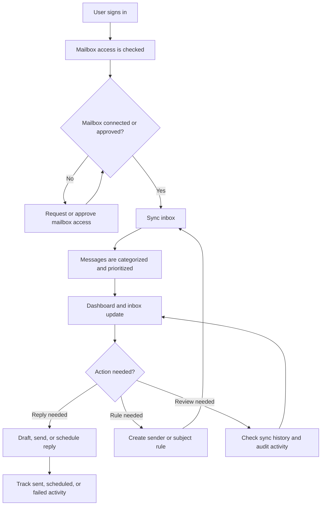
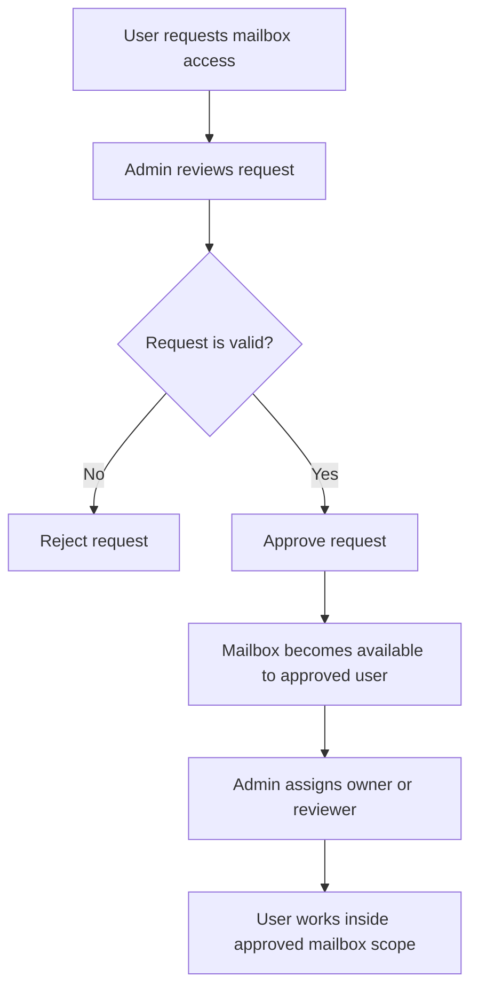
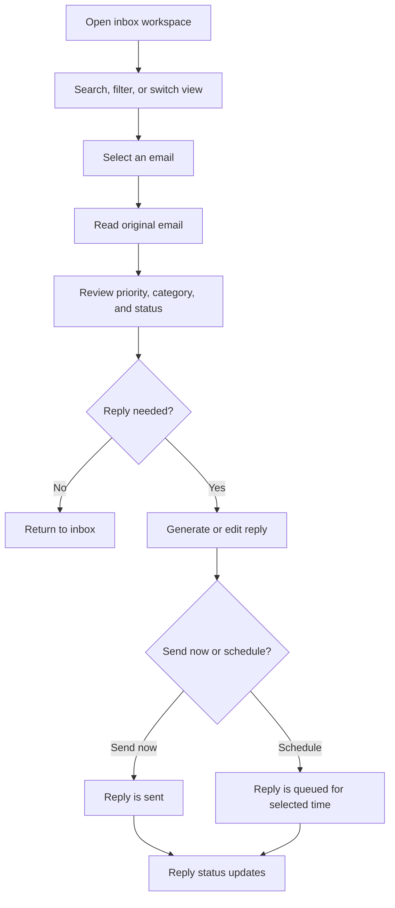
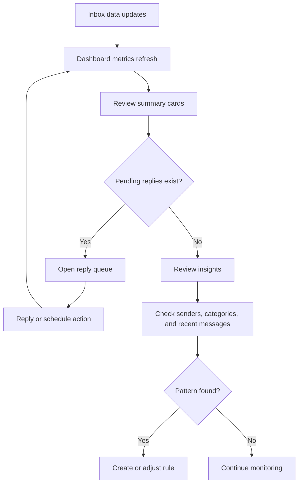
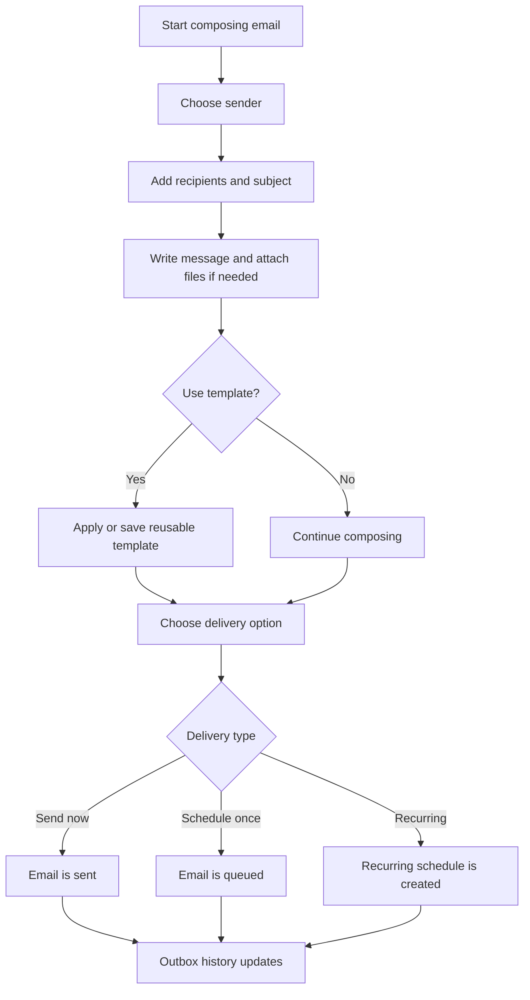
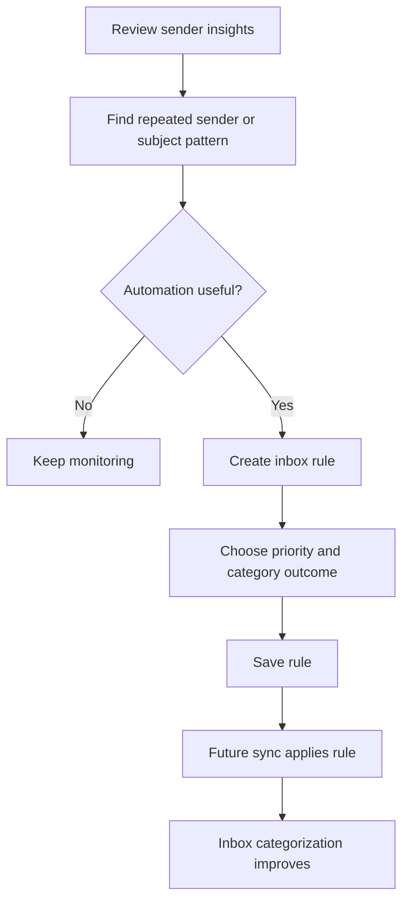
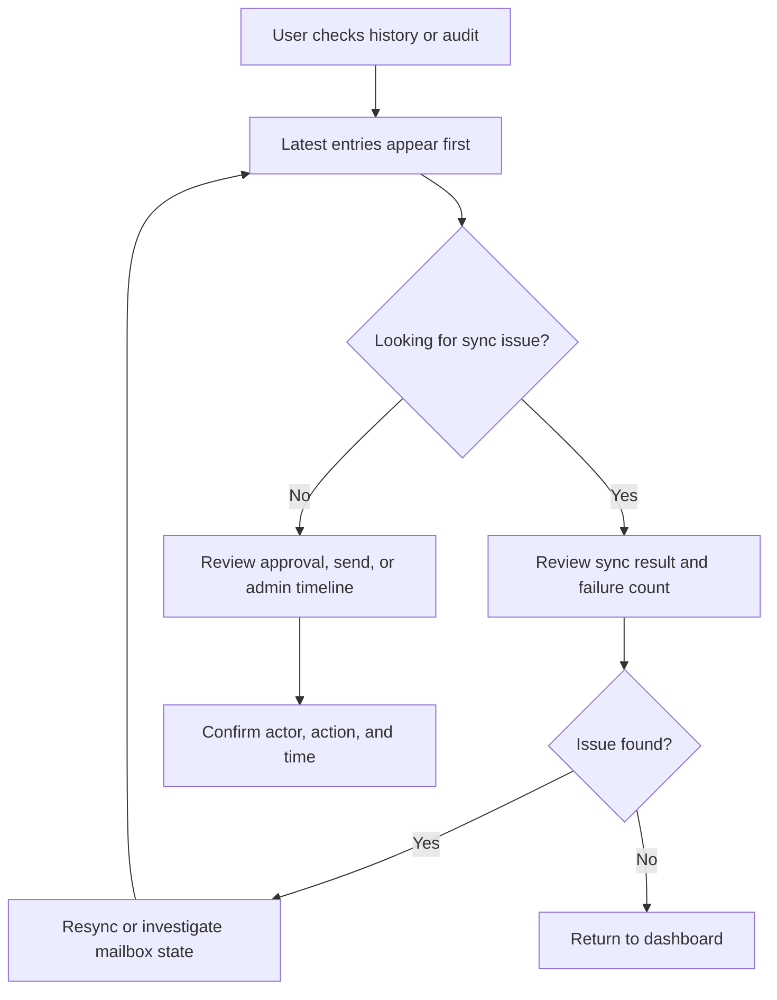
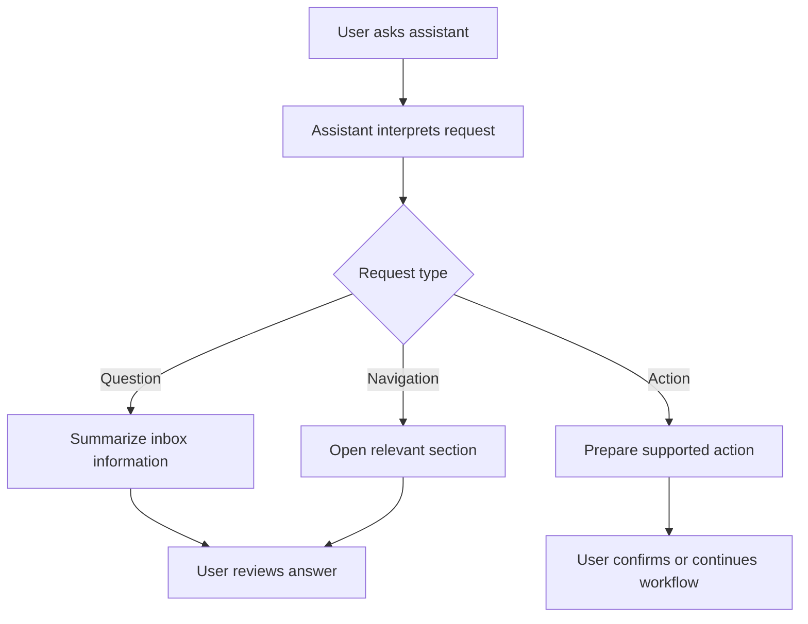
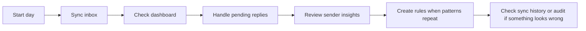

# MailPilot Project Guide

MailPilot is an inbox operations workspace for syncing Gmail messages, reviewing priority, drafting replies, scheduling outbound email, managing mailbox access, and auditing team activity.

This guide is organized by product sections. Each section includes its purpose, required information, and a working flowchart.

## Core Operating Flow

MailPilot works best as a repeated review cycle: connect or approve a mailbox, sync the inbox, review the processed messages, reply or schedule sends, then monitor activity and audit history.

## Access, Team, and Mailbox Ownership

This group covers mailbox access requests, internal roles, mailbox owners, and reviewers. These sections are combined because they all control who can view, approve, manage, or act on mailbox data.

### What This Section Does

- Approve verified mailbox access requests.
- Reject incorrect or duplicate requests.
- Assign internal roles such as admin, reviewer, or member.
- Assign mailbox owners and optional reviewers.
- Keep accountability clear for each connected mailbox.

### Information Needed

- Requester name and login email.
- Requested mailbox email.
- Approver identity.
- User role to assign.
- Mailbox owner and reviewer assignment.

### Working Flowchart

## Inbox Workspace and Email Review

This group covers the inbox workspace, message cards, filters, email detail view, original email preview, reply drafting, attachments, priority, category, and follow-up status.

### What This Section Does

- View synced emails in a working inbox.
- Filter and search messages.
- Open a message to inspect the original email and metadata.
- Review priority, category, automation notes, attachments, and reply status.
- Send immediate replies or schedule them for later.

### Information Needed

- Connected or approved mailbox.
- Current message status.
- Sender and subject.
- Reply tone, reply content, and optional attachments.
- Schedule time when a reply should be sent later.

### Working Flowchart

## Dashboard and Performance Overview

This group covers the main dashboard, summary cards, pending replies, reply performance, top senders, recent conversations, category distribution, and inbox insights.

### What This Section Does

- Give a fast operational view of the inbox.
- Show total, processed, pending, and recent email counts.
- Highlight replies that need attention.
- Show priority mix and reply coverage.
- Identify high-volume senders and recent inbox activity.
- Summarize category distribution and practical insights.

### Information Needed

- Latest sync result.
- Processed message count.
- Pending reply count.
- Priority distribution.
- Category distribution.
- Sender activity.

### Working Flowchart

## Compose, Templates, and Outbox

This group covers new outbound email, one-time sends, scheduled sends, recurring email, reusable templates, drafts, and delivery history.

### What This Section Does

- Compose new emails outside the inbox reply flow.
- Send immediately or schedule for later.
- Create recurring email schedules.
- Save reusable templates for common messages.
- Track drafts, scheduled sends, sent items, and failures.

### Information Needed

- Sender mailbox.
- Recipients, subject, and message body.
- Optional copied recipients.
- Optional attachments.
- Send time or recurrence settings.
- Template name when saving reusable content.

### Working Flowchart

## Sender Insights and Inbox Rules

This group covers sender analytics, response rates, rule suggestions, and the rule engine. These areas are combined because they turn repeated inbox patterns into automation.

### What This Section Does

- Identify senders that create the most inbox traffic.
- Review response rates and common categories.
- See suggested automation opportunities.
- Create rules based on sender or subject patterns.
- Auto-route future messages by priority, category, or archive behavior.

### Information Needed

- Rule name.
- Sender pattern or subject pattern.
- Target priority.
- Target category.
- Auto-archive preference.

### Working Flowchart

## Sync History and Audit Center

This group covers sync history, operational timeline, approval audit trail, sent replies, failed sends, and system activity. These sections are combined because they explain what happened and when.

### What This Section Does

- Confirm the latest sync result.
- Review sync counts, processed emails, skipped emails, failures, and duration.
- Track approvals, sends, failed sends, and admin actions.
- Investigate why dashboard or inbox numbers changed.
- Provide traceability for operational review.

### Information Needed

- Sync time.
- Number of fetched, processed, skipped, and failed emails.
- Approval or action actor.
- Event status.
- Event timestamp.

### Working Flowchart

## Inbox AI Assistant

This section covers the floating assistant and full assistant workspace.

### What This Section Does

- Ask questions about inbox activity.
- Navigate faster to relevant sections.
- Request help with filtering, explaining, or acting on messages.
- Start supported actions without manually moving through every screen.

### Information Needed

- Clear user question or command.
- Current mailbox scope.
- Target sender, topic, date, or action when relevant.

### Working Flowchart

## Recommended Operating Routine

Use this routine when managing active mailboxes:

- Sync inbox first.
- Review dashboard counts and pending replies.
- Work through urgent or overdue replies.
- Use sender insights to reduce repeated manual work.
- Use sync history and audit center when numbers, approvals, or sent activity need explanation.

## SK Central Identity

Mailpilot uses SK Central as its only user login and logout system. The browser requests a short-lived `sk-mailpilot` app token from SK Central, and the Mailpilot API validates that token with `SK_CENTRAL_SSO_SECRET`. Name, email, role, profile image, and profile initials come from the Central identity.

Google OAuth remains only for verifying and connecting approved Gmail mailboxes. It is not a Mailpilot sign-in method.

Local defaults:

- SK Central web: `http://localhost:5475`
- SK Central API: `http://localhost:4002/api`
- Mailpilot web: `http://localhost:5173`
- Mailpilot API: `http://localhost:5000`

Set the same signing value in SK Central's `SSO_TOKEN_SECRET` and Mailpilot's `SK_CENTRAL_SSO_SECRET`. Configure the production Central web/API URLs through the `VITE_SK_CENTRAL_*` variables shown in `frontend/.env.example`.
## Production environment handoff

Use `backend/.env.production` for the Render API and `frontend/.env.production` for the Vercel app. These real files are ignored by Git; the tracked `.env.production.example` files are safe templates.

Mailpilot reuses SK Central's Gemini key/model, Resend key, verified `MAIL_FROM` sender, and SSO signing secret. The backend prefers Gemini for email analysis when `GEMINI_API_KEY` is configured and retains Ollama as an optional local fallback.

Before deploying, replace every `PASTE_...` value in `backend/.env.production`, especially the MongoDB URI and Google OAuth credentials. In Google Cloud, allow this callback URL:

`https://sk-mailpilot.onrender.com/api/accounts/google/callback`

Copy the backend file into Render's environment settings and the frontend file into Vercel's environment settings, then redeploy both services.
